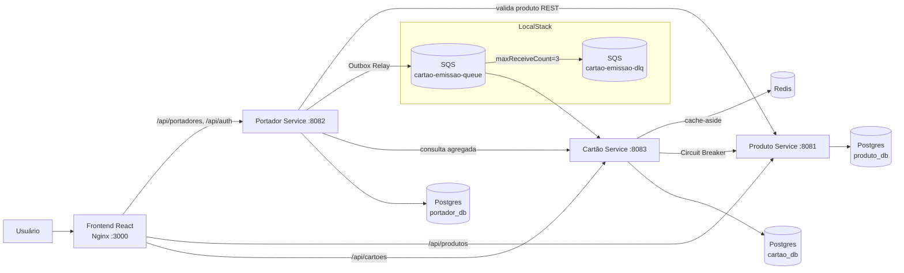
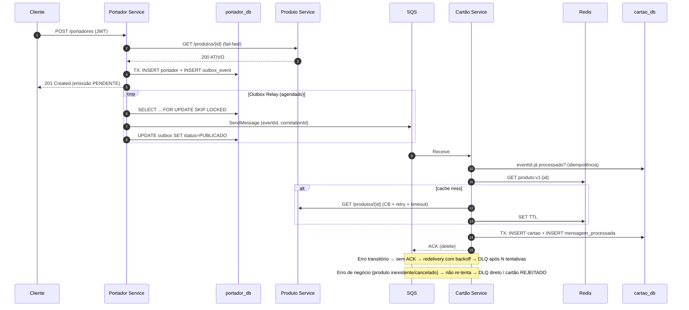

# PRD — RPE Card Processing Platform

> **Desafio Técnico:** Java Software Senior — B.U. Processamento (RPE — Retail Payment Ecosystem S/A)
> **Autor:** Victor Rodrigues · GitHub: [@vrperdomo](https://github.com/vrperdomo)
> **Repositório sugerido:** `https://github.com/vrperdomo/rpe-card-processing`
> **Versão do documento:** 1.1.0 · **Status:** Aprovado para desenvolvimento · **Prazo de entrega:** 21/09/2026

---

## Sumário

1. [Visão geral](#1-visão-geral)
2. [Análise crítica do desafio](#2-análise-crítica-do-desafio)
3. [Escopo](#3-escopo)
4. [Arquitetura](#4-arquitetura)
5. [Requisitos funcionais por serviço](#5-requisitos-funcionais-por-serviço)
6. [Requisitos não funcionais](#6-requisitos-não-funcionais)
7. [Modelo de dados](#7-modelo-de-dados)
8. [Contratos de API e mensageria](#8-contratos-de-api-e-mensageria)
9. [Estratégias de resiliência](#9-estratégias-de-resiliência)
10. [Frontend React](#10-frontend-react)
11. [Stack tecnológica](#11-stack-tecnológica)
12. [Estratégia de testes](#12-estratégia-de-testes)
13. [Git Flow e convenções](#13-git-flow-e-convenções)
14. [GitHub Actions (CI/CD)](#14-github-actions-cicd)
15. [Fases, milestones e backlog](#15-fases-milestones-e-backlog)
16. [Roadmap / Kanban no GitHub Projects](#16-roadmap--kanban-no-github-projects)
17. [Critérios de aceite da entrega](#17-critérios-de-aceite-da-entrega)
18. [Riscos e mitigações](#18-riscos-e-mitigações)
19. [Decisões tomadas](#19-decisões-tomadas)
20. [Demonstração pública sem custo](#20-demonstração-pública-sem-custo)

---

## 1. Visão geral

Ecossistema de **3 microserviços** Java/Spring Boot que gerencia o ciclo de vida de **Produtos**, **Portadores** e **Cartões**, com comunicação síncrona (REST) e assíncrona (AWS SQS via LocalStack), cache distribuído (Redis), persistência em PostgreSQL e um **frontend React** como diferencial.

**Objetivo de negócio (avaliação):** demonstrar maturidade sênior em design, resiliência, consistência de dados e qualidade de entrega — com ênfase explícita da RPE em **"sistemas que não podem parar"**: comportamento quando o **SQS cai** e quando o **Produto Service está offline**.

---

## 2. Análise crítica do desafio

### 2.1 O que o avaliador realmente vai olhar

| Critério declarado | O que significa na prática | Como vamos atender |
|---|---|---|
| SOLID / Clean Code | Separação clara de responsabilidades, domínio sem dependência de framework | Arquitetura hexagonal enxuta por serviço + ArchUnit |
| Exceções globais + HTTP semântico | `@RestControllerAdvice`, códigos corretos (201, 404, 409, 422, 503) | RFC 9457 `ProblemDetail` padronizado |
| Retry + DLQ no SQS | Falhas transitórias re-tentadas, falhas definitivas isoladas | Redrive policy (maxReceiveCount), backoff, classificação de erros |
| Cache Redis eficiente | Não é só `@Cacheable`: TTL, serialização, invalidação, cache negativo | Cache-aside com TTL, chave versionada, fallback em falha do Redis |
| Isolamento via Docker | Um comando sobe tudo, healthchecks, redes, sem dependência local | `docker compose up -d` com `depends_on: condition: service_healthy` |
| Testes (Testcontainers diferencial) | Integração real com Postgres, Redis e LocalStack | Testcontainers em todos os fluxos críticos |
| README profissional | Setup, Mermaid, decisões técnicas, garantia de produto existente | ADRs + README estruturado |
| Dica do candidato | **SQS fora** e **Produto offline** | Transactional Outbox + Circuit Breaker + cache stale |

### 2.2 Lacunas e ambiguidades do enunciado (e nossa decisão)

1. **Cadastro de Portador não inclui produto**, mas o fluxo de emissão precisa saber *qual* produto emitir.
   → **Decisão:** o request de cadastro recebe `produtoId` (dado de emissão, não atributo do portador). Registrar em ADR.
2. **"Cartão não pode ser criado para produto inexistente"** — bancos são separados (database-per-service), então não existe FK entre serviços.
   → **Decisão:** validação em **duas camadas** (fail-fast no Portador + validação autoritativa no Cartão antes de persistir). Detalhe na seção 9.4.
3. **"Se o SQS cair"** — um `send()` direto após o `save()` gera inconsistência (portador salvo, cartão nunca emitido).
   → **Decisão:** **Transactional Outbox** no Portador Service.
4. **SQS Standard entrega "at-least-once"** — mensagens podem duplicar.
   → **Decisão:** consumidor **idempotente** (tabela de mensagens processadas + constraint única).
5. **Status do Produto só tem ATIVO/CANCELADO** — cartão não deve ser emitido para produto CANCELADO.
   → **Decisão:** produto CANCELADO é tratado como erro de negócio **não re-tentável**.
6. **Dados de cartão (PCI DSS)** — o desafio não fala, mas um sênior no setor financeiro deve falar.
   → **Decisão:** nunca persistir PAN em claro nem CVV; armazenar PAN tokenizado/cifrado + `ultimos4`; PAN mascarado nas respostas.
7. **CPF é dado pessoal (LGPD)**.
   → **Decisão:** CPF validado (dígitos verificadores), único, mascarado em logs e respostas públicas.
8. **Consulta agregada** depende de 3 serviços — falha parcial precisa de comportamento definido.
   → **Decisão proposta:** resposta degradada com indicador (`"cartao": null, "avisos": [...]`) em vez de 500 (decisão 19.4).
9. **Autenticação JWT só é citada no Portador.**
   → **Decisão proposta:** Portador emite o JWT; Produto e Cartão validam o mesmo token (resource servers) (decisão 19.2).

---

## 3. Escopo

### 3.1 Dentro do escopo (MVP avaliável)
- Produto Service: cadastro, busca por ID, listagem paginada, atualização de status, auditoria.
- Portador Service: login JWT, cadastro, busca, alteração de status, outbox + publicação SQS, consulta agregada.
- Cartão Service: consumer SQS com retry/DLQ/idempotência, integração com Produto + cache Redis, consulta e alteração de status.
- Infra: `docker-compose.yml` na raiz (Postgres, Redis, LocalStack, 3 apps, frontend).
- Testes unitários + integração (Testcontainers).
- README, ADRs, diagramas Mermaid, Postman Collection.
- CI/CD com GitHub Actions.
- **Diferencial (opcional, `v1.1.0`):** Frontend React enxuto, somente após a `v1.0.0`.

### 3.2 Fora do escopo
- Deploy em cloud real (AWS). *(opcional, ver seção 19)*
- Autorização de transações, faturas, limites.
- Provedor de identidade externo (Keycloak) — apenas se decidido.
- HSM/tokenização real (simulada com AES-GCM).

---

## 4. Arquitetura

### 4.1 Visão de componentes



### 4.2 Fluxo de emissão (caminho feliz + falhas)



### 4.3 Estilo arquitetural por serviço — Hexagonal enxuta

```
br.com.rpe.<servico>
├── domain/            # Entidades, value objects (Cpf, Pan), regras, exceções de domínio — SEM Spring
├── application/       # Casos de uso (1 classe por caso), portas (interfaces in/out)
├── adapters/
│   ├── in/web/        # Controllers, DTOs de request/response, mappers, ControllerAdvice
│   ├── in/messaging/  # Listeners SQS
│   ├── out/persistence/  # JPA entities, repositories, adapters
│   ├── out/http/      # Clients REST (RestClient + Resilience4j)
│   ├── out/messaging/ # Publishers SQS
│   └── out/cache/     # Adapters Redis
└── config/            # Beans, segurança, OpenAPI, propriedades tipadas
```

**Justificativa (ADR-002):** isola regras de negócio de frameworks (testáveis sem Spring), aplica DIP (SOLID) e facilita trocar SQS/Redis. "Enxuta" = sem camadas cerimoniais desnecessárias; ArchUnit garante as fronteiras.

### 4.4 Estrutura do repositório (monorepo)

```
rpe-card-processing/
├── .github/
│   ├── workflows/            # ci-backend.yml, ci-frontend.yml, codeql.yml, e2e.yml, release.yml
│   ├── ISSUE_TEMPLATE/       # feature.yml, bug.yml, tech-debt.yml
│   ├── PULL_REQUEST_TEMPLATE.md
│   ├── CODEOWNERS
│   └── dependabot.yml
├── docs/
│   ├── adr/                  # ADR-001 ... ADR-0NN
│   ├── architecture/         # diagramas Mermaid
│   └── postman/              # rpe-card-processing.postman_collection.json + environment
├── infra/
│   ├── localstack/init-sqs.sh
│   └── postgres/init-databases.sql
├── services/
│   ├── produto-service/
│   ├── portador-service/
│   └── cartao-service/
├── frontend/                 # React + Vite + TypeScript
├── scripts/                  # setup-github.sh, smoke-test.sh, chaos-*.sh
├── pom.xml                   # POM agregador (parent) — versões centralizadas
├── docker-compose.yml
├── .env.example
├── CLAUDE.md
├── PRD.md
└── README.md
```

**Decisão:** monorepo com POM agregador (sem módulo "shared-domain" para não acoplar serviços). Contratos de mensagem são duplicados de forma consciente em cada serviço (produtor e consumidor evoluem de forma independente) e protegidos por teste de contrato com JSON Schema.

---

## 5. Requisitos funcionais por serviço

### 5.1 Produto Service (Catálogo) — porta 8081

| ID | Requisito | Prioridade |
|---|---|---|
| PR-01 | `POST /api/v1/produtos` cadastra produto (nome, descrição, categoria ex.: BLACK/GOLD/PLATINUM) | Must |
| PR-02 | `GET /api/v1/produtos/{id}` busca por ID | Must |
| PR-03 | `GET /api/v1/produtos` lista paginada (filtro por status) | Should |
| PR-04 | `PATCH /api/v1/produtos/{id}/status` altera status (ATIVO → CANCELADO) | Should |
| PR-05 | Auditoria: `criado_em`, `atualizado_em` (JPA Auditing), `versao` (optimistic lock) | Must (Sênior) |
| PR-06 | Nome de produto único → 409 em duplicidade | Should |
| PR-07 | Produto CANCELADO não volta para ATIVO (máquina de estados) | Should |
| PR-08 | Publicar `ProdutoAtualizado` (after-commit) em `produto-eventos-queue` ao alterar/cancelar | Must (decisão 19.3) |

### 5.2 Portador Service (Orquestrador) — porta 8082

| ID | Requisito | Prioridade |
|---|---|---|
| PO-01 | `POST /api/v1/auth/login` emite JWT (usuário técnico seed, senha BCrypt) | Must |
| PO-02 | Todos os endpoints de negócio exigem Bearer JWT | Must |
| PO-03 | `POST /api/v1/portadores` cadastra (nome, CPF, dataNascimento, produtoId); status inicial ATIVO | Must |
| PO-04 | CPF válido (dígito verificador) e único → 422 / 409 | Must |
| PO-05 | Validação fail-fast do produto (existe e ATIVO) antes de salvar → 422 | Must |
| PO-06 | Persistir portador + evento de outbox na **mesma transação** | Must |
| PO-07 | Outbox Relay publica no SQS com retry e marca como publicado | Must |
| PO-08 | `GET /api/v1/portadores/{id}` | Must |
| PO-09 | `GET /api/v1/portadores/{id}/completo` → Portador + Cartão + Produto | Must |
| PO-10 | `PATCH /api/v1/portadores/{id}/status` (ATIVO, BLOQUEADO, CANCELADO) | Should |
| PO-11 | Header `Idempotency-Key` opcional no POST para evitar cadastro duplo por retry do cliente | Could |
| PO-12 | Maior de idade (≥ 18 anos completos) → 422 | Must (decisão 19.7) |

### 5.3 Cartão Service (Core) — porta 8083

| ID | Requisito | Prioridade |
|---|---|---|
| CA-01 | Consumer SQS `cartao-emissao-queue` gera cartão | Must |
| CA-02 | Idempotência por `eventId` (e constraint única por portador+produto) | Must |
| CA-03 | Busca produto no Produto Service com cache Redis (cache-aside, TTL) | Must |
| CA-04 | Circuit Breaker + Retry + Timeout na chamada ao Produto | Must |
| CA-05 | Produto inexistente/CANCELADO → cartão não é criado; mensagem vai para DLQ (não re-tentável) | Must |
| CA-06 | Erros transitórios → redelivery com backoff → DLQ após `maxReceiveCount` | Must |
| CA-07 | Geração de PAN válido (Luhn, BIN por produto), armazenado cifrado; resposta mascarada | Must |
| CA-08 | `GET /api/v1/cartoes/{id}` e `GET /api/v1/cartoes?portadorId=` (com dados do produto) | Must |
| CA-09 | `PATCH /api/v1/cartoes/{id}/status` (ATIVO, BLOQUEADO, CANCELADO; CANCELADO é terminal) | Should |
| CA-10 | Endpoint operacional para inspecionar/reprocessar DLQ (`/api/v1/admin/dlq`) | Could (diferencial) |

---

## 6. Requisitos não funcionais

| Categoria | Requisito |
|---|---|
| Disponibilidade | Serviços sobem com healthchecks; indisponibilidade de dependência não derruba o serviço |
| Resiliência | Outbox, retry com backoff exponencial + jitter, circuit breaker, DLQ, idempotência |
| Performance | Consulta de produto p95 < 20 ms com cache quente; pool de conexões dimensionado |
| Segurança | JWT (HS256 com segredo ≥ 256 bits via env ou RS256), BCrypt, sem segredos no repo, CORS restrito, headers seguros, validação de entrada |
| Privacidade | CPF/PAN mascarados em logs e respostas; nenhum CVV persistido |
| Observabilidade | Actuator (health, liveness, readiness, metrics), Micrometer/Prometheus, logs JSON, `X-Correlation-Id` propagado em HTTP e atributos SQS |
| Qualidade | Cobertura JaCoCo ≥ 80% em `domain` e `application`; Spotless; ArchUnit; zero vulnerabilidade crítica |
| Portabilidade | `docker compose up -d` único comando; nenhum pré-requisito além de Docker |
| Documentação | OpenAPI 3 por serviço (Swagger UI), README, ADRs, Postman |

---

## 7. Modelo de dados

**Database-per-service** em uma única instância Postgres (3 databases criados via `init-databases.sql`). Migrações com **Flyway**. `ddl-auto=validate`.

### produto_db
```sql
produto (
  id UUID PK,
  nome VARCHAR(100) NOT NULL UNIQUE,
  descricao VARCHAR(255),
  categoria VARCHAR(30) NOT NULL,
  bin VARCHAR(6) NOT NULL,
  status VARCHAR(20) NOT NULL CHECK (status IN ('ATIVO','CANCELADO')),
  versao BIGINT NOT NULL,
  criado_em TIMESTAMPTZ NOT NULL,
  atualizado_em TIMESTAMPTZ NOT NULL
)
```

### portador_db
```sql
portador (
  id UUID PK, nome VARCHAR(150) NOT NULL, cpf CHAR(11) NOT NULL UNIQUE,
  data_nascimento DATE NOT NULL, produto_id UUID NOT NULL,
  status VARCHAR(20) NOT NULL, status_emissao VARCHAR(20) NOT NULL, -- PENDENTE, SOLICITADA
  versao BIGINT, criado_em TIMESTAMPTZ, atualizado_em TIMESTAMPTZ
)
outbox_event (
  id UUID PK, aggregate_type VARCHAR(50), aggregate_id UUID, event_type VARCHAR(80),
  payload JSONB NOT NULL, status VARCHAR(20) NOT NULL, -- PENDENTE, PUBLICADO, FALHOU
  tentativas INT DEFAULT 0, proxima_tentativa_em TIMESTAMPTZ, ultimo_erro TEXT,
  criado_em TIMESTAMPTZ, publicado_em TIMESTAMPTZ
)
INDEX idx_outbox_pendente ON outbox_event (status, proxima_tentativa_em)
usuario (id, username UNIQUE, senha_hash, roles)
```

### cartao_db
```sql
cartao (
  id UUID PK, portador_id UUID NOT NULL, produto_id UUID NOT NULL,
  pan_cifrado VARCHAR(255) NOT NULL, pan_hash CHAR(64) NOT NULL UNIQUE, ultimos4 CHAR(4) NOT NULL,
  nome_impresso VARCHAR(26), validade CHAR(5) NOT NULL,
  status VARCHAR(20) NOT NULL, versao BIGINT, criado_em TIMESTAMPTZ, atualizado_em TIMESTAMPTZ,
  UNIQUE (portador_id, produto_id)
)
mensagem_processada (event_id UUID PK, processada_em TIMESTAMPTZ NOT NULL)
```

---

## 8. Contratos de API e mensageria

### 8.1 Padrão de erro (RFC 9457)
```json
{
  "type": "https://api.rpe.local/errors/produto-inexistente",
  "title": "Produto inexistente",
  "status": 422,
  "detail": "Produto 3f2a... não encontrado ou não está ATIVO",
  "instance": "/api/v1/portadores",
  "correlationId": "b7c1...",
  "timestamp": "2026-09-17T12:00:00Z",
  "errors": [{ "field": "cpf", "message": "CPF inválido" }]
}
```

### 8.2 Mapa de status HTTP
| Situação | Status |
|---|---|
| Criado | 201 + `Location` |
| Validação de payload | 400 |
| Não autenticado / token inválido | 401 |
| Sem permissão | 403 |
| Recurso não encontrado | 404 |
| Duplicidade / conflito de versão | 409 |
| Regra de negócio violada | 422 |
| Dependência indisponível (circuito aberto) | 503 + `Retry-After` |

### 8.3 Mensagem `CartaoEmissaoSolicitada` (v1)
```json
{
  "eventId": "uuid",
  "eventType": "CartaoEmissaoSolicitada",
  "eventVersion": 1,
  "occurredAt": "2026-09-17T12:00:00Z",
  "correlationId": "uuid",
  "data": {
    "portadorId": "uuid",
    "produtoId": "uuid",
    "nomeImpresso": "VICTOR RODRIGUES"
  }
}
```
**Regra:** a mensagem **não** carrega CPF (minimização de dados — LGPD). Atributos SQS: `correlationId`, `eventType`, `eventVersion`.

### 8.4 Consulta agregada `GET /api/v1/portadores/{id}/completo`
```json
{
  "portador": { "id": "...", "nome": "...", "cpf": "***.456.789-**", "status": "ATIVO" },
  "cartao":  { "id": "...", "panMascarado": "5234 **** **** 1234", "validade": "09/31", "status": "ATIVO" },
  "produto": { "id": "...", "nome": "Gold", "categoria": "GOLD", "status": "ATIVO" },
  "emissao": "CONCLUIDA",
  "avisos": []
}
```

---

## 9. Estratégias de resiliência

### 9.1 SQS indisponível → Transactional Outbox
- O cadastro **nunca** falha por causa do SQS: portador e evento são gravados atomicamente.
- Relay agendado (`@Scheduled`, lote configurável) usa `SELECT ... FOR UPDATE SKIP LOCKED` (seguro com múltiplas réplicas).
- Falha no envio → incrementa `tentativas`, calcula `proxima_tentativa_em` com backoff exponencial + jitter; após N tentativas → status `FALHOU` + métrica/alerta.
- Quando o SQS volta, o backlog é drenado automaticamente. **Demonstração:** `docker compose stop localstack` → cadastrar → `start` → cartão emitido.

### 9.2 Consumo SQS → Retry + DLQ
- Fila principal com `RedrivePolicy { maxReceiveCount: 3 }` apontando para a DLQ; `VisibilityTimeout` > tempo máximo de processamento.
- Ack **somente em sucesso** (`AcknowledgementMode.ON_SUCCESS`).
- Classificação de erros:
  - **Transitórios** (Produto offline, timeout, DB indisponível, circuito aberto) → exceção → mensagem volta após visibility timeout com backoff crescente → DLQ ao esgotar.
  - **Definitivos** (produto inexistente/cancelado, payload inválido, versão de evento desconhecida) → não adianta re-tentar → envio direto para DLQ com motivo em atributo, e ack da original.
- Idempotência: `mensagem_processada` inserida na mesma transação do cartão; duplicata = ack sem efeito.

### 9.3 Produto Service offline → Cache + Circuit Breaker
- **Cache-aside** no Cartão Service: chave `produto:v1:{id}`, TTL padrão 10 min (configurável), serialização JSON.
- **Cache negativo** para 404 com TTL curto (ex.: 60 s) — evita martelar o Produto com IDs inválidos.
- Resilience4j: `TimeLimiter` (2 s), `Retry` (3x, backoff exponencial, só em erros transitórios), `CircuitBreaker` (janela deslizante, 50% de falha).
- Redis indisponível → `CacheErrorHandler` loga e segue para chamada direta (cache nunca é ponto único de falha).
- Circuito aberto + cache miss → consumer re-tenta via SQS (não perde a mensagem); endpoints REST retornam 503.

### 9.4 Garantia: cartão nunca é criado para produto inexistente
1. **Portador (fail-fast):** valida produto existente e ATIVO antes de gravar → 422.
2. **Cartão (autoritativo):** antes do `INSERT`, obtém o produto (cache ou REST). Inexistente/CANCELADO → cartão **não** é criado, mensagem para DLQ com motivo.
3. **Cache consistente:** cache negativo curto; o evento `ProdutoAtualizado` remove a chave ao cancelar (decisão 19.3); o TTL limita a janela de inconsistência caso o evento se perca.
4. **Testes** automatizados provam os três cenários (inexistente, cancelado, offline).

---

## 10. Frontend React

### 10.1 Recomendação
**React 19 + Vite + TypeScript**, em `frontend/`, servido por **Nginx** no Docker Compose e atuando como **reverse proxy** para as APIs (`/api/produtos → produto-service`, etc.). Isso elimina CORS em produção local e mantém um único ponto de entrada (`http://localhost:3000`).

| Camada | Escolha | Motivo |
|---|---|---|
| Build | Vite | Rápido, padrão de mercado |
| Linguagem | TypeScript strict | Segurança de tipos |
| Dados | TanStack Query | Cache de servidor, retry, estados de loading/erro |
| Formulários | React Hook Form + Zod | Validação de CPF no cliente espelhando o backend |
| UI | Tailwind CSS + shadcn/ui | Produtivo e profissional |
| Rotas | React Router | Rotas protegidas por JWT |
| Tipos da API | `openapi-typescript` gerado dos Swagger | Contrato único backend ↔ frontend |
| Testes | Vitest + Testing Library + MSW; Playwright (E2E) | Pirâmide completa |

### 10.2 Telas
1. **Login** (JWT em memória, sem `localStorage` — decisão 19.5).
2. **Produtos:** lista, cadastro, cancelamento.
3. **Portadores:** lista, cadastro (com seleção de produto ATIVO), status.
4. **Detalhe do Portador:** visão agregada com **status da emissão em tempo quase real** (polling via TanStack Query até `CONCLUIDA`).
5. **Painel de Saúde** (diferencial): status dos serviços via Actuator, tamanho da fila/DLQ, estado do circuit breaker — ótimo para *demonstrar ao avaliador* a resiliência.

### 10.3 Por que é um diferencial seguro
- Não altera o escopo do backend (consome as mesmas APIs).
- Fica em fase própria (Fase 7, `v1.1.0`), **depois** da `v1.0.0` do backend. Pelo prazo, entra em escopo enxuto (ver seção 15).
- Pode ser desligado (`docker compose up -d` sobe tudo; `--profile` opcional se desejado).

---

## 11. Stack tecnológica

| Item | Versão/escolha | Observação |
|---|---|---|
| Java | 21 (LTS) | Virtual threads, records, pattern matching |
| Spring Boot | 3.5.x (última linha 3.x) | Enunciado pede 3.x; **confirmar patch mais recente no início** |
| Spring Cloud AWS | 3.x (`spring-cloud-aws-starter-sqs`) | Compatível com Boot 3 |
| Resilience4j | `resilience4j-spring-boot3` | CB, Retry, TimeLimiter |
| Persistência | Spring Data JPA + PostgreSQL 16 + Flyway | |
| Cache | Spring Data Redis + Redis 7 | Lettuce |
| Segurança | Spring Security + OAuth2 Resource Server (JWT) | |
| Docs API | springdoc-openapi 2.x | Swagger UI por serviço |
| Mapeamento | MapStruct | Sem reflexão em runtime |
| Build | Maven Wrapper | POM agregador |
| Testes | JUnit 5, AssertJ, Mockito, Testcontainers, WireMock, Awaitility, ArchUnit, JaCoCo | |
| Qualidade | Spotless (google-java-format), OWASP/Dependabot, CodeQL, Trivy, Gitleaks | |
| Infra | Docker, Docker Compose v2, LocalStack | Imagens multi-stage, usuário não-root |
| Frontend | React 19, Vite, TypeScript, Tailwind, TanStack Query | |

> **Regra:** fixar versões exatas no `pom.xml`/`package.json` e deixar o Dependabot propor atualizações.

---

## 12. Estratégia de testes

| Nível | Ferramentas | Cobertura mínima |
|---|---|---|
| Unitário (domínio/casos de uso) | JUnit 5, AssertJ, Mockito | Regras de CPF, Luhn, máquinas de estado, classificação de erros |
| Web slice | `@WebMvcTest` + Security | Status HTTP, validação, ProblemDetail, 401/403 |
| Persistência | `@DataJpaTest` + Testcontainers Postgres | Flyway, constraints, `SKIP LOCKED` |
| Integração | `@SpringBootTest` + Testcontainers (Postgres, Redis, LocalStack) + WireMock | Fluxos críticos abaixo |
| Arquitetura | ArchUnit | Domínio não depende de Spring/adapters |
| Contrato | JSON Schema do evento | Produtor e consumidor validam o mesmo schema |
| E2E | Script de smoke + Playwright | Compose completo no CI |

**Cenários críticos obrigatórios:**
1. Cadastro de portador → evento no outbox → mensagem no SQS.
2. SQS fora → cadastro 201 → SQS volta → mensagem publicada.
3. Consumer cria cartão com produto do cache (sem chamar Produto na 2ª vez — verificado no WireMock).
4. Mensagem duplicada → apenas um cartão.
5. Produto inexistente → nenhum cartão, mensagem na DLQ.
6. Produto offline → retries → DLQ após `maxReceiveCount`; com Produto de volta antes disso → cartão criado.
7. Redis fora → emissão continua funcionando.
8. JWT ausente/expirado → 401.

---

## 13. Git Flow e convenções

### 13.1 Branches
| Branch | Origem | Destino | Uso |
|---|---|---|---|
| `main` | — | — | Código de release, protegido, sempre deployável, tags `vX.Y.Z` |
| `develop` | `main` | — | Integração contínua, protegido |
| `feature/<issue>-<descricao>` | `develop` | `develop` | Ex.: `feature/12-produto-crud` |
| `bugfix/<issue>-<descricao>` | `develop` | `develop` | Correções antes do release |
| `release/<x.y.z>` | `develop` | `main` + `develop` | Estabilização, versão, changelog |
| `hotfix/<x.y.z>` | `main` | `main` + `develop` | Correção urgente em release |
| `docs/<issue>-<descricao>` | `develop` | `develop` | Apenas documentação |
| `chore/<issue>-<descricao>` / `ci/<...>` | `develop` | `develop` | Build, infra, pipelines |

### 13.2 Merge strategy
- `feature/*` → `develop`: **Squash and merge** (1 commit Conventional por feature).
- `release/*` e `hotfix/*` → `main`: **Merge commit** (preserva histórico) + tag anotada.
- Back-merge `main` → `develop` após release/hotfix.

### 13.3 Proteção de branches (`main` e `develop`)
- PR obrigatório, 1 aprovação (em projeto solo: exigir status checks e usar auto-review via Claude + checklist).
- Status checks obrigatórios: `backend-ci`, `frontend-ci`, `codeql`, `e2e` (em `main`).
- Branch atualizada antes do merge, histórico linear em `develop`, sem force-push, sem deleção.
- Commits assinados (recomendado — GPG ou SSH signing).

### 13.4 Conventional Commits
```
<tipo>(<escopo>): <descrição no imperativo, minúscula, ≤ 72 chars>

<corpo: o quê e por quê>

Refs: #<issue>
```
- **Tipos:** `feat`, `fix`, `refactor`, `perf`, `test`, `docs`, `build`, `ci`, `chore`, `style`, `revert`.
- **Escopos:** `produto`, `portador`, `cartao`, `frontend`, `infra`, `ci`, `docs`, `deps`.
- `BREAKING CHANGE:` no rodapé quando aplicável.
- **Todos os commits são feitos manualmente pelo Victor.**

### 13.5 Versionamento
SemVer. Cada fase concluída gera uma release menor (`v0.1.0` … `v0.7.0`); entrega final = `v1.0.0`.

---

## 14. GitHub Actions (CI/CD)

| Workflow | Gatilho | Jobs |
|---|---|---|
| `ci-backend.yml` | PR e push em `develop`/`main` com mudanças em `services/**` ou `pom.xml` | `dorny/paths-filter` → matriz por serviço: Spotless check → build → testes unit + integração (Testcontainers) → JaCoCo (gate) → upload de relatórios |
| `ci-frontend.yml` | Mudanças em `frontend/**` | `npm ci` → lint → typecheck → Vitest (cobertura) → build |
| `codeql.yml` | PR, push e agendado semanal | Análise Java e TypeScript |
| `security.yml` | PR e agendado | Gitleaks (segredos), Trivy (filesystem + imagens), dependency review |
| `e2e.yml` | PR para `main` e manual | `docker compose up -d --wait` → smoke tests (Newman com a Postman Collection) → cenários de caos → logs como artefato → `down -v` |
| `docker-publish.yml` | Push de tag `v*` | Build multi-stage, push para GHCR (`ghcr.io/vrperdomo/...`), SBOM e provenance |
| `release.yml` | Push de tag `v*` | GitHub Release com changelog gerado |
| `pr-lint.yml` | PR aberto/editado | Valida título Conventional Commit e nome da branch |

**Boas práticas obrigatórias:**
- `permissions:` mínimas por workflow (`contents: read` por padrão).
- Actions de terceiros **fixadas por SHA** (Dependabot atualiza).
- `concurrency` com `cancel-in-progress` para PRs.
- Cache de Maven (`actions/setup-java` com `cache: maven`) e npm.
- `timeout-minutes` em todos os jobs.
- Segredos só via `secrets`/`vars`; nada em texto no YAML.
- `dependabot.yml` para `maven`, `npm`, `docker` e `github-actions`.

---

## 15. Fases, milestones e backlog

> **Prazo final: 21/09/2026 (segunda-feira).** Planejamento iniciado em 17/09/2026. São 5 dias corridos.
> **Estratégia de prazo:** o backend completo e avaliável é entregue como **`v1.0.0` no domingo 20/09**. O frontend vira **`v1.1.0`** e só entra se sobrar tempo. Segunda-feira fica como **buffer**, sem funcionalidade nova.
> Cada fase = 1 milestone = 1 release. Uma fase só começa com CI verde em `develop`.
> Com o prazo curto, é permitido agrupar 2–3 issues pequenas da mesma fase em um único PR, desde que o título referencie todas (`Refs: #9 #10`).

### Cronograma

| Dia | Data | Fases | Meta do dia |
|---|---|---|---|
| Qui | 17/09 | F0 + F1 | Repo, CI, Compose saudável; Produto Service completo (`v0.1.0`, `v0.2.0`) |
| Sex | 18/09 | F2 + F3 | Cartão core com cache/CB; Portador com JWT + Outbox (`v0.3.0`, `v0.4.0`) |
| Sáb | 19/09 | F4 + F5 | Consumer SQS, DLQ, idempotência; agregação, caos, Postman, E2E (`v0.5.0`, `v0.6.0`) |
| Dom | 20/09 | F6 | Hardening, README final, release **`v1.0.0`** ✅ entrega mínima garantida |
| Seg | 21/09 | F7 (opcional) + buffer | Frontend enxuto `v1.1.0` **somente se** a v1.0.0 estiver impecável; envio da entrega |

**Regra de corte:** se às 18h de um dia a meta não estiver cumprida, o próximo dia começa por ela e os itens `priority:p2` da fase seguinte são adiados. Os "Could" nunca bloqueiam release.

### Fase 0 — Fundação · `M0 - Fundação` · `v0.1.0` · 17/09
- [ ] #1 Criar repositório, `main`/`develop`, proteção de branches
- [ ] #2 Labels, milestones, templates de issue/PR, CODEOWNERS
- [ ] #3 GitHub Project (Kanban + Roadmap)
- [ ] #4 POM agregador, Maven Wrapper, Spotless, JaCoCo, `.editorconfig`, `.gitignore`
- [ ] #5 Skeleton dos 3 serviços (Boot 3.5, Actuator, OpenAPI, Dockerfile multi-stage não-root)
- [ ] #6 `docker-compose.yml`: Postgres (3 DBs), Redis, LocalStack (filas + DLQs) e healthchecks
- [ ] #7 Workflows base: `ci-backend`, `pr-lint`, `codeql`, `security`, `dependabot`
- [ ] #8 README inicial + ADR-001 (monorepo) + ADR-002 (hexagonal) + `.devcontainer` (Codespaces)

**DoD:** `docker compose up -d --wait` sobe tudo saudável; CI verde; `/actuator/health` = UP nos 3 serviços.

### Fase 1 — Produto Service · `M1 - Produto Service` · `v0.2.0` · 17/09
- [ ] #9 Domínio Produto + máquina de estados + testes unitários
- [ ] #10 Flyway + JPA Auditing + optimistic locking
- [ ] #11 Endpoints REST (criar, buscar, listar, status) + OpenAPI
- [ ] #12 `GlobalExceptionHandler` com ProblemDetail + Correlation ID
- [ ] #13 Resource server JWT (valida token emitido pelo Portador)
- [ ] #14 Publicação do evento `ProdutoAtualizado` (after-commit) na fila `produto-eventos-queue`
- [ ] #15 Testes de integração (Testcontainers) + ArchUnit

**DoD:** CRUD funcional e protegido; evento publicado ao cancelar; cobertura ≥ 80%.

### Fase 2 — Cartão Core · `M2 - Cartão Core` · `v0.3.0` · 18/09
- [ ] #16 Domínio Cartão (Luhn, PAN, validade, estados) + testes
- [ ] #17 Cifra de PAN (AES-GCM) + hash para unicidade + mascaramento
- [ ] #18 Client REST do Produto (RestClient) + Resilience4j (timeout, retry, CB)
- [ ] #19 Cache Redis cache-aside + cache negativo + `CacheErrorHandler` + ADR-003
- [ ] #20 Listener `ProdutoAtualizado` → evicção da chave no Redis
- [ ] #21 Endpoints de consulta e alteração de status + resource server JWT
- [ ] #22 Testes: WireMock (offline/404/lento), Testcontainers Redis/Postgres

**DoD:** cache comprovado em teste; produto cancelado invalida o cache; Produto offline não derruba o serviço.

### Fase 3 — Portador Service · `M3 - Portador Service` · `v0.4.0` · 18/09
- [ ] #23 Emissão de JWT (login, usuário seed, BCrypt, `iss`/`aud`) + ADR-004
- [ ] #24 Domínio Portador (CPF VO, maioridade ≥ 18, estados) + testes
- [ ] #25 Cadastro com validação fail-fast do produto (existe e ATIVO)
- [ ] #26 Transactional Outbox (tabela + gravação atômica) + ADR-005
- [ ] #27 Outbox Relay (SKIP LOCKED, backoff, métricas) + publisher SQS
- [ ] #28 Endpoints de consulta e status
- [ ] #29 Testes de integração: cadastro → outbox → SQS; SQS fora → recuperação

**DoD:** o cadastro nunca perde evento, mesmo com o LocalStack parado.

### Fase 4 — Emissão Assíncrona · `M4 - Emissão Assíncrona` · `v0.5.0` · 19/09
- [ ] #30 Listener SQS no Cartão (ack on success, visibility timeout)
- [ ] #31 Idempotência (`mensagem_processada` + `UNIQUE(portador_id, produto_id)`)
- [ ] #32 Classificação transitório × definitivo + DLQ direta com motivo + ADR-006
- [ ] #33 Backoff na redelivery + métricas de DLQ
- [ ] #34 Contrato do evento (JSON Schema) testado nos dois lados
- [ ] #35 *(Could)* Endpoint admin de DLQ (inspecionar/reprocessar)

**DoD:** todos os cenários críticos da seção 12 passam automaticamente.

### Fase 5 — Agregação & Resiliência · `M5 - Agregação & Resiliência` · `v0.6.0` · 19/09
- [ ] #36 `GET /portadores/{id}/completo` com chamadas paralelas e resposta degradada (`avisos`)
- [ ] #37 Status de emissão refletido na consulta
- [ ] #38 Scripts de caos (`chaos-sqs-down.sh`, `chaos-produto-down.sh`)
- [ ] #39 Postman Collection + environment + Newman
- [ ] #40 Workflow `e2e.yml`

**DoD:** o avaliador reproduz os cenários da "Dica do Candidato" com um comando cada.

### Fase 6 — Hardening & Release · `M6 - Release 1.0` · **`v1.0.0`** · 20/09
- [ ] #41 Observabilidade: logs JSON, métricas custom
- [ ] #42 Revisão de segurança (OWASP Top 10, headers, CORS, segredos) + code review final + ADR-007 (PAN/LGPD)
- [ ] #43 README final (setup, Mermaid, decisões, garantia de produto, caos, Codespaces, troubleshooting)
- [ ] #44 Gravação da demo (GIF/vídeo) dos cenários de resiliência
- [ ] #45 `docker-publish.yml` (GHCR) + `release.yml`
- [ ] #46 `release/1.0.0` → `main` → tag `v1.0.0` → back-merge

**DoD:** checklist da seção 17 100% atendido. **Esta é a entrega oficial.**

### Fase 7 — Frontend React (opcional) · `M7 - Frontend` · `v1.1.0` · 21/09
Escopo enxuto, na ordem de prioridade (parar onde o tempo acabar):
- [ ] #47 Setup Vite + TS + Tailwind + Dockerfile Nginx (proxy reverso) + `ci-frontend.yml`
- [ ] #48 Login + rotas protegidas
- [ ] #49 Cadastro de portador (com seleção de produto ATIVO) + detalhe agregado com polling da emissão
- [ ] #50 Painel de saúde/resiliência (Actuator, circuit breaker, fila/DLQ)
- [ ] #51 *(Could)* Telas de produtos, Playwright E2E

**DoD:** fluxo "login → cadastrar portador → ver cartão emitido" pela UI em `http://localhost:3000`.
**Regra:** se a v1.1.0 não estiver estável até o horário de envio, **não** é mergeada em `main`, e a entrega fica na `v1.0.0`.

---

## 16. Roadmap / Kanban no GitHub Projects

### 16.1 Estrutura do Project (`RPE Card Processing — Roadmap`)
**Colunas (campo Status):** `📥 Backlog` → `🎯 Ready` → `🚧 In Progress` → `👀 In Review` → `🧪 QA` → `✅ Done` · (`⛔ Blocked` como coluna auxiliar)

**Campos customizados:**
| Campo | Tipo | Valores |
|---|---|---|
| Fase | Single select | F0 … F7 |
| Serviço | Single select | produto, portador, cartao, frontend, infra, docs |
| Prioridade | Single select | P0 (crítica), P1, P2 |
| Estimativa | Number | pontos (1, 2, 3, 5, 8) |
| Início / Fim | Date | usados na visão Roadmap |

**Visões:** Board (Kanban por Status) · Roadmap (timeline por Início/Fim, agrupado por Milestone) · Tabela por Fase · "Meu trabalho" (filtro `assignee:@me status:"In Progress"`).

**Automações nativas:** item adicionado → Backlog; PR aberto vinculado → In Review; issue fechada / PR merged → Done.

### 16.2 Labels
`type:feature` · `type:bug` · `type:tech-debt` · `type:docs` · `type:ci` · `type:test` · `svc:produto` · `svc:portador` · `svc:cartao` · `svc:frontend` · `svc:infra` · `priority:p0` · `priority:p1` · `priority:p2` · `status:blocked` · `good-first-task`

### 16.3 Script de criação (executado **por você**, com `gh` CLI)

> Pré-requisitos: `gh auth login` e `gh auth refresh -s project,read:project`.
> Salve como `scripts/setup-github.sh`, revise e execute manualmente.

```bash
#!/usr/bin/env bash
set -euo pipefail

OWNER="vrperdomo"
REPO="rpe-card-processing"
FULL="$OWNER/$REPO"

# ---------- Labels ----------
while IFS='|' read -r name color desc; do
  gh label create "$name" --repo "$FULL" --color "$color" --description "$desc" --force
done <<'EOF'
type:feature|1D76DB|Nova funcionalidade
type:bug|D73A4A|Correção de defeito
type:tech-debt|FBCA04|Débito técnico
type:docs|0075CA|Documentação
type:ci|5319E7|Pipelines e automação
type:test|0E8A16|Testes
svc:produto|C5DEF5|Produto Service
svc:portador|BFD4F2|Portador Service
svc:cartao|D4C5F9|Cartão Service
svc:frontend|F9D0C4|Frontend React
svc:infra|E4E669|Docker, LocalStack, Postgres, Redis
priority:p0|B60205|Crítica
priority:p1|D93F0B|Alta
priority:p2|FEF2C0|Normal
status:blocked|000000|Bloqueada
EOF

# ---------- Milestones ----------
create_milestone () {
  gh api "repos/$FULL/milestones" -f title="$1" -f description="$2" -f due_on="$3" >/dev/null
  echo "Milestone criado: $1"
}
# Datas alinhadas ao prazo de 21/09/2026 (fim do dia em Brasília = 02:59Z do dia seguinte)
create_milestone "M0 - Fundação"                 "Repo, governança, CI base, Docker Compose"          "2026-09-18T02:59:59Z"
create_milestone "M1 - Produto Service"          "Catálogo com auditoria e evento ProdutoAtualizado"  "2026-09-18T02:59:59Z"
create_milestone "M2 - Cartão Core"              "Domínio, integração Produto, cache Redis"           "2026-09-19T02:59:59Z"
create_milestone "M3 - Portador Service"         "JWT, cadastro, Transactional Outbox"                "2026-09-19T02:59:59Z"
create_milestone "M4 - Emissão Assíncrona"       "Consumer SQS, retry, DLQ, idempotência"             "2026-09-20T02:59:59Z"
create_milestone "M5 - Agregação & Resiliência"  "Consulta completa, caos, Postman, E2E"              "2026-09-20T02:59:59Z"
create_milestone "M6 - Release 1.0"              "Hardening, docs, demo, release v1.0.0 (ENTREGA)"    "2026-09-21T02:59:59Z"
create_milestone "M7 - Frontend"                 "React enxuto, release v1.1.0 (opcional)"            "2026-09-21T20:00:00Z"

# ---------- Project (Kanban + Roadmap) ----------
PROJECT_NUMBER=$(gh project create --owner "$OWNER" --title "RPE Card Processing — Roadmap" --format json | jq -r '.number')
gh project link "$PROJECT_NUMBER" --owner "$OWNER" --repo "$FULL"
echo "Project #$PROJECT_NUMBER criado e vinculado."

# ---------- Issues (exemplo da Fase 0 — repita o padrão para as demais) ----------
new_issue () { # título | labels | milestone | corpo
  url=$(gh issue create --repo "$FULL" --title "$1" --label "$2" --milestone "$3" --body "$4")
  gh project item-add "$PROJECT_NUMBER" --owner "$OWNER" --url "$url" >/dev/null
  echo "Issue: $url"
}

new_issue "[F0] Configurar proteção de branches main/develop" "type:ci,svc:infra,priority:p0" "M0 - Fundação" \
"## Objetivo
Proteger \`main\` e \`develop\`.
## Critérios de aceite
- [ ] PR obrigatório
- [ ] Status checks obrigatórios
- [ ] Sem force-push/deleção"

new_issue "[F0] Docker Compose com Postgres, Redis e LocalStack" "type:feature,svc:infra,priority:p0" "M0 - Fundação" \
"## Critérios de aceite
- [ ] 3 databases criados no init
- [ ] Filas cartao-emissao-queue e DLQ com RedrivePolicy
- [ ] Healthchecks em todos os containers
- [ ] \`docker compose up -d --wait\` retorna sucesso"
```

> Os campos customizados (Fase, Serviço, Prioridade, Estimativa, datas) e as visões Board/Roadmap são configurados uma vez pela interface do GitHub Projects (Settings do Project) — é mais seguro e rápido do que via GraphQL.

---

## 17. Critérios de aceite da entrega

- [ ] Repositório público `vrperdomo/rpe-card-processing`
- [ ] `docker-compose.yml` na raiz sobe Postgres, Redis, LocalStack e os 3 apps (+ frontend, se `v1.1.0`) com **um comando**
- [ ] Java 21 + Spring Boot 3.x
- [ ] Swagger em cada serviço
- [ ] JWT funcional no Portador
- [ ] Emissão assíncrona via SQS com Retry e DLQ
- [ ] Redis obrigatório no Cartão para dados de produto
- [ ] Auditoria (criação/atualização) no Produto
- [ ] Consulta agregada Portador + Cartão + Produto
- [ ] Tratamento global de exceções com HTTP semântico
- [ ] Testes unitários e de integração (Testcontainers) nos fluxos críticos
- [ ] README com setup, Mermaid, decisões técnicas e garantia de produto existente
- [ ] Postman Collection (ou insomnia.json)
- [ ] Demonstração documentada de **SQS fora** e **Produto offline**
- [ ] CI verde na tag `v1.0.0`
- [ ] Badge do Codespaces e demo gravada no README
- [ ] Link do repositório enviado à RPE até **21/09/2026**

---

## 18. Riscos e mitigações

| Risco | Impacto | Mitigação |
|---|---|---|
| **Prazo de 5 dias com fim de semana** | **Crítico** | Cronograma diário com regra de corte; `v1.0.0` no domingo; segunda como buffer |
| Over-engineering consumir o prazo | Alto | Fases com DoD; diferenciais (frontend, DLQ admin) só após a `v1.0.0` |
| LocalStack instável no CI | Médio | Versão fixada, `--wait`, healthcheck, retries no init |
| Testcontainers lento no CI | Médio | Reuso de containers por classe base, cache Maven, paralelismo por serviço |
| Cache servindo produto cancelado | Médio | Evento `ProdutoAtualizado` + TTL curto + validação no ponto de emissão |
| Perda do evento `ProdutoAtualizado` (sem outbox no Produto) | Baixo | TTL de 10 min como rede de segurança; outbox registrado como evolução |
| Duplicidade de cartão | Alto | Idempotência + constraint única |
| Vazamento de dados sensíveis | Alto | Mascaramento, minimização no evento, Gitleaks, sem segredos no repo |
| Incompatibilidade de versões (Boot × Spring Cloud AWS × Resilience4j) | Médio | Validar matriz de compatibilidade na Fase 0 |

---

## 19. Decisões tomadas

| # | Tema | Decisão | ADR |
|---|---|---|---|
| 19.1 | Prazo | **21/09/2026**. Backend `v1.0.0` em 20/09; frontend `v1.1.0` opcional em 21/09 | — |
| 19.2 | Autenticação | Portador **emite** o JWT (usuário seed + BCrypt). Produto e Cartão são **resource servers** que validam o mesmo token (`iss`/`aud`). Segredo via variável de ambiente | ADR-004 |
| 19.3 | Invalidação de cache | Produto publica `ProdutoAtualizado` na fila `produto-eventos-queue` **após o commit** (`@TransactionalEventListener(AFTER_COMMIT)`). O Cartão consome e remove `produto:v1:{id}`. O **TTL curto (10 min) é a rede de segurança** caso o evento se perca. Trade-off consciente: sem outbox no Produto, por prazo; documentado como evolução | ADR-003 |
| 19.4 | Consulta agregada com falha parcial | **Resposta degradada** (200) com `cartao`/`produto` nulos e lista `avisos`. Retorna 503 apenas se o próprio portador não puder ser lido | — |
| 19.5 | Token no frontend | Em **memória** (não usa `localStorage`); expiração curta; novo login ao expirar. Trade-off documentado (BFF com cookie HttpOnly como evolução) | ADR-008 |
| 19.6 | Cartões por portador | **Um cartão por par portador + produto** (`UNIQUE(portador_id, produto_id)`) | ADR-006 |
| 19.7 | Idade mínima | **18 anos** completos na data do cadastro → 422 caso contrário | — |
| 19.8 | Demo pública | **Somente opções sem custo** (ver seção 20) | — |
| 19.9 | Nome do repositório | `vrperdomo/rpe-card-processing` | — |

---

## 20. Demonstração pública sem custo

**Premissa:** custo zero e **nenhum cartão de crédito cadastrado**. As hospedagens "free" (Render, Koyeb etc.) mudam as regras com frequência e não comportam bem 3 JVMs + Postgres + Redis + LocalStack. Além disso, costumam hibernar, e o avaliador veria erro ou lentidão no primeiro acesso, o que prejudica mais do que ajuda.

**Estratégia recomendada (sem custo para o Victor):**

| Opção | Custo | O que entrega | Fase |
|---|---|---|---|
| **GitHub Codespaces** com `.devcontainer/` + badge "Open in GitHub Codespaces" no README | Zero para o Victor (consome a cota gratuita da conta de **quem abre**) | O avaliador sobe o ambiente completo no navegador, sem instalar nada | F0 (#8) |
| **Demo gravada** (GIF no README + vídeo curto não listado no YouTube) | Zero | Mostra o fluxo e os cenários de caos (SQS fora, Produto offline) funcionando | F6 (#44) |
| **Imagens no GHCR** (`ghcr.io/vrperdomo/...`) | Zero para repositório público | `docker compose pull` sem precisar compilar | F6 (#45) |
| **CI público** com badges (build, cobertura, CodeQL) | Zero para repositório público | Evidência objetiva de qualidade | F0 |

**Hospedagem real online:** fica **fora do escopo até 21/09**. Só será reavaliada depois da entrega, e apenas se houver um plano comprovadamente gratuito, sem cartão cadastrado e sem hibernação que atrapalhe a avaliação. As condições atuais devem ser verificadas no momento, e não assumidas.

---
*Documento vivo: atualize via PR (`docs/...`) a cada decisão tomada, registrando ADRs em `docs/adr/`.*
