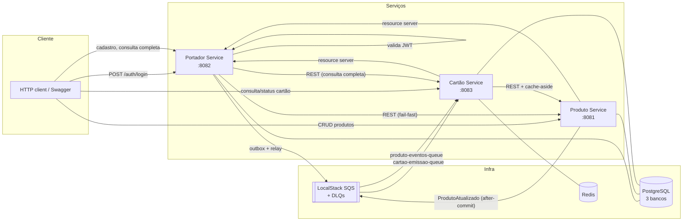

# RPE Card Processing Platform

Desafio técnico **Java Software Senior — RPE (B.U. Processamento)**: emissão de cartões de crédito
orquestrada por 3 microserviços (Produto, Portador, Cartão), com REST, mensageria assíncrona (SQS
via LocalStack), cache Redis, PostgreSQL e Docker Compose.

> Repositório: [`vrperdomo/rpe-card-processing`](https://github.com/vrperdomo/rpe-card-processing) · Autor: Victor Rodrigues

---

## Sumário

- [Visão geral](#visão-geral)
- [Arquitetura](#arquitetura)
- [Setup em 1 comando](#setup-em-1-comando)
- [URLs e portas](#urls-e-portas)
- [Autenticação](#autenticação)
- [Fluxo de emissão de cartão](#fluxo-de-emissão-de-cartão)
- [Decisões técnicas](#decisões-técnicas)
- [Garantia: cartão nunca é criado para produto inexistente](#garantia-cartão-nunca-é-criado-para-produto-inexistente)
- [Resiliência](#resiliência)
- [Segurança](#segurança)
- [Testes](#testes)
- [CI](#ci)
- [Troubleshooting](#troubleshooting)
- [Release](#release)

---

## Visão geral

Três microserviços independentes, cada um com seu próprio banco (database-per-service):

| Serviço | Responsabilidade | Porta |
|---|---|---|
| **Produto** | Catálogo de produtos de cartão (Gold/Black/Platinum), auditoria, publica `ProdutoAtualizado` | 8081 |
| **Portador** | Emite JWT, cadastra portadores (≥ 18 anos), dispara emissão de cartão via Outbox + SQS | 8082 |
| **Cartão** | Domínio autoritativo do cartão: cifra o PAN, consome a fila de emissão, consulta e altera status | 8083 |

Todos expõem OpenAPI/Swagger, health checks (Actuator) e métricas Prometheus.

## Arquitetura



Cada serviço segue **hexagonal enxuta**: `domain` (sem Spring/JPA) → `application` (casos de uso +
portas) → `adapters/in|out` (web, mensageria, persistência, HTTP, cache, segurança) → `config`.

## Setup em 1 comando

```bash
cp .env.example .env
docker compose up -d --build --wait
```

Isso sobe Postgres (3 bancos), Redis, LocalStack (filas + DLQs já provisionadas) e os 3 serviços,
aguardando todos os healthchecks ficarem `healthy`. Para derrubar:

```bash
docker compose down -v
```

## URLs e portas

| Serviço | URL |
|---|---|
| Produto (Swagger) | http://localhost:8081/swagger-ui.html |
| Portador (Swagger) | http://localhost:8082/swagger-ui.html |
| Cartão (Swagger) | http://localhost:8083/swagger-ui.html |
| LocalStack | http://localhost:4566 |
| Postgres | localhost:5432 |
| Redis | localhost:6379 |

## Autenticação

O **Portador** é o único emissor de JWT; Produto e Cartão são *resource servers* que validam o
mesmo segredo (`JWT_SECRET`/`JWT_ISSUER`/`JWT_AUDIENCE`, compartilhados via `.env`).

```bash
curl -s -X POST http://localhost:8082/api/v1/auth/login \
  -H "Content-Type: application/json" \
  -d '{"username":"admin","password":"admin123"}'
```

A resposta traz um `accessToken` (Bearer) a ser usado em `Authorization: Bearer <accessToken>` nas
chamadas aos três serviços. Usuário seed só existe em ambiente local/demo (sem cadastro de usuários
nesta fase).

Cada serviço também gera, internamente, um **token de serviço-para-serviço** (`EmissorTokenServico`,
mesmo segredo) para chamar os outros serviços via `RestClient` — não é o mesmo token do usuário.

## Fluxo de emissão de cartão

1. `POST /api/v1/portadores` (Portador) — valida CPF, maioridade (≥ 18 anos) e **fail-fast** se o
   produto não existir ou não estiver `ATIVO` (422). Grava o portador **e** o evento
   `CartaoEmissaoSolicitada` na mesma transação (Transactional Outbox — [ADR-005](docs/adr/005-transactional-outbox.md)).
2. O **Outbox Relay** (scheduler) publica o evento pendente em `cartao-emissao-queue` com retry e
   backoff; marca como publicado ou incrementa tentativas em caso de falha.
3. O **Cartão** consome a fila: valida o produto (cache-aside + circuit breaker), gera o PAN
   (Luhn, a partir do BIN do produto), cifra (AES-GCM) e persiste o cartão. Idempotente por
   `eventId` **e** pela constraint única `portador_id + produto_id`.
4. `GET /api/v1/portadores/{id}/completo` (Portador) agrega Portador + Cartão + Produto numa única
   resposta, com `emissao: PENDENTE | CONCLUIDA | DESCONHECIDA` conforme o estado observado.

```bash
# 1. login
TOKEN=$(curl -s -X POST http://localhost:8082/api/v1/auth/login \
  -H "Content-Type: application/json" -d '{"username":"admin","password":"admin123"}' | jq -r .accessToken)

# 2. cadastrar um produto
PRODUTO_ID=$(curl -s -X POST http://localhost:8081/api/v1/produtos \
  -H "Authorization: Bearer $TOKEN" -H "Content-Type: application/json" \
  -d '{"nome":"Gold","descricao":"Cartão Gold","categoria":"GOLD","bin":"453201"}' | jq -r .id)

# 3. cadastrar um portador para esse produto
PORTADOR_ID=$(curl -s -X POST http://localhost:8082/api/v1/portadores \
  -H "Authorization: Bearer $TOKEN" -H "Content-Type: application/json" \
  -d "{\"nome\":\"Victor Rodrigues\",\"cpf\":\"52998224725\",\"dataNascimento\":\"1990-01-01\",\"produtoId\":\"$PRODUTO_ID\"}" | jq -r .id)

# 4. consultar a emissão (repita até "emissao":"CONCLUIDA" — é assíncrono)
curl -s http://localhost:8082/api/v1/portadores/$PORTADOR_ID/completo -H "Authorization: Bearer $TOKEN" | jq
```

## Decisões técnicas

Registradas como ADRs em [`docs/adr/`](docs/adr/):

| ADR | Decisão |
|---|---|
| [003](docs/adr/003-estrategia-cache.md) | Cache-aside no Cartão (TTL 10 min + cache negativo 60 s), evicção por evento |
| [004](docs/adr/004-autenticacao-jwt.md) | JWT: Portador emite, Produto e Cartão validam |
| [005](docs/adr/005-transactional-outbox.md) | Transactional Outbox para a emissão de cartão (garantia de entrega) |
| [007](docs/adr/007-protecao-dados-pan-lgpd.md) | Cifra (AES-GCM) + hash (SHA-256+pepper) para o PAN, mascaramento sempre na resposta |

Outras decisões relevantes (sem ADR dedicado, documentadas inline no código):

- **`ProdutoAtualizado` via `@TransactionalEventListener(AFTER_COMMIT)`, não Outbox** — ao contrário
  da emissão de cartão, a perda ocasional deste evento é tolerável: o TTL do cache-aside é a rede
  de segurança (no máximo 10 min de inconsistência).
- **Consulta agregada com chamadas sequenciais** (Portador → Cartão → Produto), não paralelas —
  decisão de escopo para caber no prazo revisado (ver `CLAUDE.md` seção 3.1); paralelização de I/O
  fica para uma iteração futura.
- **Backoff do consumer de emissão via mecanismo nativo do SQS** (`maxReceiveCount` + visibility
  timeout), não Resilience4j explícito — mesma razão de escopo.

## Garantia: cartão nunca é criado para produto inexistente

1. **Portador (fail-fast):** valida produto existente e `ATIVO` antes de gravar → `422`.
2. **Cartão (autoritativo):** antes de emitir, consulta o produto de novo (cache ou REST).
   Inexistente ou `CANCELADO` → cartão **não** é criado, mensagem vai para a DLQ com o motivo.
3. **Cache consistente:** cache negativo de 60 s para 404; o evento `ProdutoAtualizado` remove a
   chave ao cancelar; o TTL de 10 min limita a janela de inconsistência caso o evento se perca.

## Resiliência

### SQS fora do ar

O Portador continua aceitando cadastros normalmente: o evento fica `PENDENTE` na tabela de outbox
e o Relay tenta publicar a cada execução, com backoff exponencial. Assim que o SQS volta, o próximo
ciclo do Relay publica o(s) evento(s) pendente(s) — nenhum cadastro é perdido.

Para reproduzir manualmente (script dedicado ficou fora do escopo desta entrega — ver seção 3.1 do
`CLAUDE.md`):

```bash
docker compose stop localstack
# cadastre um portador normalmente (o POST continua respondendo 201)
docker compose start localstack
# aguarde o próximo ciclo do relay (rpe.portador.outbox.relay.intervalo, default 5s)
```

### Produto Service fora do ar

- **Consulta de cartão/consulta agregada:** com circuito aberto e sem entrada em cache, o endpoint
  REST retorna `503` + `Retry-After` (nunca inventa dado do produto).
- **Emissão assíncrona:** o consumer do Cartão propaga `DependenciaIndisponivelException`, a
  mensagem **não** é confirmada (ack) e o SQS reentrega automaticamente até `maxReceiveCount`,
  quando então a própria fila move a mensagem para a DLQ via redrive policy.

```bash
docker compose stop produto-service
# GET num cartão/portador cujo produto não está em cache deve retornar 503 + Retry-After
docker compose start produto-service
```

### Erros na emissão de cartão (classificação)

| Tipo | Exemplos | Comportamento |
|---|---|---|
| **Transitório** | Produto Service indisponível (circuito aberto/timeout) | Mensagem não é confirmada → SQS reentrega até `maxReceiveCount` → DLQ automática |
| **Definitivo** | Produto inexistente/`CANCELADO`, payload ilegível, schema/versão incompatível | Envio direto para a DLQ com motivo (`erro-motivo`), sem redelivery |

## Segurança

- **Segredos:** nunca commitados — só via `.env` (ignorado pelo Git) e `.env.example` com valores
  fictícios claramente marcados como inseguros.
- **PAN:** nunca persistido em claro. Cifrado com AES-GCM (IV aleatório por chamada) + hash
  SHA-256 com pepper para checar unicidade sem decifrar o dataset. Resposta sempre mascarada
  (`**** **** **** 1234`). Ver [ADR-007](docs/adr/007-protecao-dados-pan-lgpd.md).
- **CPF:** mascarado em toda resposta (`***.456.789-**`) e nunca aparece no payload dos eventos
  SQS (minimização de dados, LGPD).
- **CVV:** não persistido em nenhum momento (nem gerado — fora do escopo do desafio).
- **Senhas:** BCrypt (usuário seed, ambiente local apenas).
- **JWT:** segredo via variável de ambiente, expiração curta, `iss`/`aud` validados nos 3 serviços.
- **Endpoints públicos:** só `/api/v1/auth/login`, `/actuator/health/**`, `/v3/api-docs/**`,
  `/swagger-ui/**` — todo o resto exige Bearer JWT.
- **SQL/JPQL:** só via Spring Data (repositórios derivados/JPQL parametrizado), nunca concatenação.
- **Logs:** correlationId propagado (header `X-Correlation-Id` → MDC → atributos SQS); nunca CPF ou
  PAN completos em log.

## Testes

```bash
./mvnw verify                                    # tudo (unit + integração + gate de cobertura)
./mvnw -pl services/cartao-service verify         # um serviço
./mvnw -pl services/cartao-service test -Dtest=CartaoEmissaoSolicitadaListenerIT
```

- Unitários (domínio/aplicação) com JUnit 5 + AssertJ + Mockito.
- `@DataJpaTest` + Testcontainers Postgres para os repositórios.
- `@SpringBootTest` + Testcontainers (Postgres, Redis, LocalStack reais) para os fluxos críticos:
  cadastro → outbox → SQS, publicação do `ProdutoAtualizado`, consumo de `CartaoEmissaoSolicitada`
  (feliz, produto inexistente → DLQ, payload ilegível → DLQ, erro transitório → sem DLQ manual).
- WireMock para os clients HTTP entre serviços (offline, 404, lento, retry, circuito aberto).
- Cobertura mínima JaCoCo de 80% em `domain` + `application` (gate no CI).

## CI

Workflows em `.github/workflows/`: `ci-backend` (build + testes + cobertura por serviço, só o
serviço alterado via `dorny/paths-filter`), `codeql`, `security` (Trivy + gitleaks +
dependency-review), `pr-lint` (Conventional Commits + padrão de nome de branch). Todo PR passa
pelos quatro workflows antes do merge; branch protection formal em `develop`/`main` ainda não foi
configurada no GitHub (backlog).

## Troubleshooting

| Sintoma | Causa provável | Solução |
|---|---|---|
| `docker compose up` trava em "waiting" | Healthcheck de algum serviço não passou | `docker compose logs -f <serviço>`; confira se a porta já está em uso no host |
| `401` em toda chamada | Token expirado ou `JWT_SECRET` diferente entre serviços | Refaça o login; confirme que os 3 serviços usam o mesmo `.env` |
| `503` ao consultar cartão/produto | Circuito aberto (Produto/Cartão fora) | Aguarde `wait-duration-in-open-state` (10s) ou suba o serviço dependente |
| Emissão nunca sai de `PENDENTE` | Outbox Relay desativado ou SQS fora | Confira `rpe.portador.outbox.relay.ativo` e `docker compose ps localstack` |
| Erro de `ddl-auto: validate` no boot | Migração Flyway com tipo de coluna incompatível com o campo JPA (`CHAR` vs `VARCHAR`) | Confira se toda coluna mapeada para `String` usa `VARCHAR` na migração |
| `docker compose config` falha | Variável de ambiente ausente no `.env` | Rode `cp .env.example .env` e ajuste os valores |

## Release

Este projeto **não** usa `docker-publish.yml`/`release.yml` automatizados (fora do escopo desta
entrega — ver `CLAUDE.md` seção 3.1). As imagens buildam localmente via `docker compose up --build`.
A tag de release é criada manualmente:

```bash
git switch main && git pull
git merge --no-ff develop
git tag -a v1.0.0 -m "Release v1.0.0"
git push origin main --tags
gh release create v1.0.0 --title "v1.0.0" --generate-notes
git switch develop && git merge --no-ff main
git push origin develop
```
