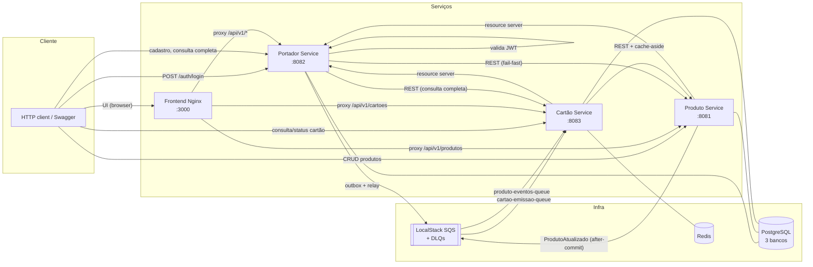

# RPE Card Processing Platform

Desafio técnico **Java Software Senior — RPE (B.U. Processamento)**: emissão de cartões de crédito
orquestrada por 3 microserviços (Produto, Portador, Cartão), com REST, mensageria assíncrona (SQS
via LocalStack), cache Redis, PostgreSQL e Docker Compose.

> Repositório: [`vrperdomo/rpe-card-processing`](https://github.com/vrperdomo/rpe-card-processing) · Autor: Victor Rodrigues

---

## Sumário

- [Visão geral](#visão-geral)
- [Arquitetura](#arquitetura)
- [Setup em 1 comando](#setup-em-1-comando)
- [URLs e portas](#urls-e-portas)
- [Autenticação](#autenticação)
- [Fluxo de emissão de cartão](#fluxo-de-emissão-de-cartão)
- [Decisões técnicas](#decisões-técnicas)
- [Garantia: cartão nunca é criado para produto inexistente](#garantia-cartão-nunca-é-criado-para-produto-inexistente)
- [Resiliência](#resiliência)
- [Segurança](#segurança)
- [Testes](#testes)
- [CI](#ci)
- [Troubleshooting](#troubleshooting)
- [Release](#release)

---

## Visão geral

Três microserviços independentes, cada um com seu próprio banco (database-per-service):

| Serviço | Responsabilidade | Porta |
|---|---|---|
| **Produto** | Catálogo de produtos de cartão (Gold/Black/Platinum), auditoria, publica `ProdutoAtualizado` | 8081 |
| **Portador** | Emite JWT, cadastra portadores (≥ 18 anos), dispara emissão de cartão via Outbox + SQS | 8082 |
| **Cartão** | Domínio autoritativo do cartão: cifra o PAN, consome a fila de emissão, consulta e altera status | 8083 |
| **Frontend** | SPA React servida por Nginx, que também é o proxy reverso de `/api/v1/*` (uma origem só, sem CORS) — [ADR-008](docs/adr/008-frontend-react-nginx.md) | 3000 |

Os 3 serviços expõem OpenAPI/Swagger, health checks (Actuator) e métricas Prometheus.

## Arquitetura



Cada serviço segue **hexagonal enxuta**: `domain` (sem Spring/JPA) → `application` (casos de uso +
portas) → `adapters/in|out` (web, mensageria, persistência, HTTP, cache, segurança) → `config`.

## Setup em 1 comando

```bash
cp .env.example .env
docker compose up -d --build --wait
```

Isso sobe Postgres (3 bancos), Redis, LocalStack (filas + DLQs já provisionadas), os 3 serviços e o
frontend (Nginx), aguardando todos os healthchecks ficarem `healthy`. Para derrubar:

```bash
docker compose down -v
```

## URLs e portas

| Serviço | URL |
|---|---|
| Frontend | http://localhost:3000 |
| Produto (Swagger) | http://localhost:8081/swagger-ui.html |
| Portador (Swagger) | http://localhost:8082/swagger-ui.html |
| Cartão (Swagger) | http://localhost:8083/swagger-ui.html |
| LocalStack | http://localhost:4566 |
| Postgres | localhost:5432 |
| Redis | localhost:6379 |

## Autenticação

O **Portador** é o único emissor de JWT; Produto e Cartão são *resource servers* que validam o
mesmo segredo (`JWT_SECRET`/`JWT_ISSUER`/`JWT_AUDIENCE`, compartilhados via `.env`).

```bash
curl -s -X POST http://localhost:8082/api/v1/auth/login \
  -H "Content-Type: application/json" \
  -d '{"username":"admin","password":"admin123"}'
```

A resposta traz um `accessToken` (Bearer) a ser usado em `Authorization: Bearer <accessToken>` nas
chamadas aos três serviços. Usuário seed só existe em ambiente local/demo (sem cadastro de usuários
nesta fase).

**No frontend** (`http://localhost:3000`, mesmas credenciais): o token fica **só em memória** — nunca
em `localStorage`, `sessionStorage` nem cookie —, então recarregar a página pede novo login. As
rotas privadas redirecionam para `/login` e voltam ao destino original depois de entrar. Quando o
token expira (ou o backend responde 401) a sessão é encerrada com um aviso, e "Sair" também
descarta os dados em cache. Erros seguem o `ProblemDetail`: 401 mostra "Usuário ou senha
inválidos", 429 informa o `Retry-After` do limite de tentativas, 503 e falha de rede têm mensagem
própria, e o `correlationId` aparece como "código de suporte" para achar a requisição nos logs.

Cada serviço também gera, internamente, um **token de serviço-para-serviço** (`EmissorTokenServico`,
mesmo segredo) para chamar os outros serviços via `RestClient` — não é o mesmo token do usuário.

## Fluxo de emissão de cartão

1. `POST /api/v1/portadores` (Portador) — valida CPF, maioridade (≥ 18 anos) e **fail-fast** se o
   produto não existir ou não estiver `ATIVO` (422). Grava o portador **e** o evento
   `CartaoEmissaoSolicitada` na mesma transação (Transactional Outbox — [ADR-005](docs/adr/005-transactional-outbox.md)).
2. O **Outbox Relay** (scheduler) publica o evento pendente em `cartao-emissao-queue` com retry e
   backoff; marca como publicado ou incrementa tentativas em caso de falha.
3. O **Cartão** consome a fila: valida o produto (cache-aside + circuit breaker), gera o PAN
   (Luhn, a partir do BIN do produto), cifra (AES-GCM) e persiste o cartão. Idempotente por
   `eventId` **e** pela constraint única `portador_id + produto_id`.
4. `GET /api/v1/portadores/{id}/completo` (Portador) agrega Portador + Cartão + Produto numa única
   resposta, com `emissao: PENDENTE | CONCLUIDA | FALHOU | DESCONHECIDA` conforme o estado
   observado. `FALHOU` (a mensagem foi para a DLQ) vem com `falhaEmissao: { motivo, ocorridaEm }`;
   `DESCONHECIDA` é o Cartão fora do ar (a consulta segue `200`, com `avisos`).

```bash
# 1. login
TOKEN=$(curl -s -X POST http://localhost:8082/api/v1/auth/login \
  -H "Content-Type: application/json" -d '{"username":"admin","password":"admin123"}' | jq -r .accessToken)

# 2. cadastrar um produto
PRODUTO_ID=$(curl -s -X POST http://localhost:8081/api/v1/produtos \
  -H "Authorization: Bearer $TOKEN" -H "Content-Type: application/json" \
  -d '{"nome":"Gold","descricao":"Cartão Gold","categoria":"GOLD","bin":"453201"}' | jq -r .id)

# 3. cadastrar um portador para esse produto
PORTADOR_ID=$(curl -s -X POST http://localhost:8082/api/v1/portadores \
  -H "Authorization: Bearer $TOKEN" -H "Content-Type: application/json" \
  -d "{\"nome\":\"Victor Rodrigues\",\"cpf\":\"52998224725\",\"dataNascimento\":\"1990-01-01\",\"produtoId\":\"$PRODUTO_ID\"}" | jq -r .id)

# 4. consultar a emissão (repita até "emissao":"CONCLUIDA" — é assíncrono)
curl -s http://localhost:8082/api/v1/portadores/$PORTADOR_ID/completo -H "Authorization: Bearer $TOKEN" | jq
```

Alternativa aos curls acima: importe `docs/postman/RPE-Card-Processing.postman_collection.json` e o
environment `docs/postman/RPE-Local.postman_environment.json` no Postman e rode a pasta "Fluxo de
emissão de cartão" — cada requisição salva automaticamente o token/id necessário para a próxima
(login → criar produto → cadastrar portador → consultar completo). Reexecutável sem colisão (nome
do produto e CPF gerados dinamicamente a cada rodada).

**Pela interface** (`http://localhost:3000`, depois do login): **Cadastrar portador** pede nome, CPF
(com máscara e validação dos dígitos), data de nascimento (18 anos ou mais) e um produto **ATIVO**
escolhido numa lista; ao cadastrar, abre o **detalhe do portador**, que consulta
`GET /portadores/{id}/completo` sozinho (a cada 2 s enquanto a emissão está `PENDENTE`) até o cartão
aparecer, com o número sempre mascarado. Se o serviço de Cartão ou o de Produto estiver fora do ar,
a tela continua mostrando o que tem, com os `avisos` da resposta degradada, e passa a consultar mais
devagar (5 s). Como o backend não tem estado de falha na emissão (uma mensagem que vai para a DLQ
continua `PENDENTE`), o polling **desiste após 2 minutos** e explica; "Atualizar" consulta de novo
a qualquer momento. Não há listagem de portadores na API, então o detalhe também abre pelo
identificador na página inicial. Cadastro de produto continua pelo Swagger/Postman.

## Decisões técnicas

Registradas como ADRs em [`docs/adr/`](docs/adr/):

| ADR | Decisão |
|---|---|
| [001](docs/adr/001-monorepo-pom-agregador.md) | Monorepo com POM Maven agregador para os 3 serviços |
| [002](docs/adr/002-arquitetura-hexagonal-enxuta.md) | Arquitetura hexagonal enxuta, verificada por ArchUnit |
| [003](docs/adr/003-estrategia-cache.md) | Cache-aside no Cartão (TTL 10 min + cache negativo 60 s), evicção por evento |
| [004](docs/adr/004-autenticacao-jwt.md) | JWT: Portador emite, Produto e Cartão validam |
| [005](docs/adr/005-transactional-outbox.md) | Transactional Outbox para a emissão de cartão (garantia de entrega) |
| [006](docs/adr/006-retry-dlq-idempotencia.md) | Retry, DLQ e idempotência na emissão assíncrona; por que o backoff entre entregas SQS não foi implementado |
| [007](docs/adr/007-protecao-dados-pan-lgpd.md) | Cifra (AES-GCM) + hash (SHA-256+pepper) para o PAN, mascaramento sempre na resposta |
| [009](docs/adr/009-revisao-seguranca-owasp.md) | Revisão de segurança contra OWASP Top 10, categoria por categoria, com evidência |

Outras decisões relevantes (sem ADR dedicado, documentadas inline no código):

- **`ProdutoAtualizado` via `@TransactionalEventListener(AFTER_COMMIT)`, não Outbox** — ao contrário
  da emissão de cartão, a perda ocasional deste evento é tolerável: o TTL do cache-aside é a rede
  de segurança (no máximo 10 min de inconsistência).
- **Consulta agregada com chamadas sequenciais** (Portador → Cartão → Produto), não paralelas —
  decisão de escopo para caber no prazo revisado (ver `CLAUDE.md` seção 3.1); paralelização de I/O
  fica para uma iteração futura.
- **Backoff do consumer de emissão via mecanismo nativo do SQS** (`maxReceiveCount` + visibility
  timeout) combinado com o Retry+CircuitBreaker+TimeLimiter já existente na chamada HTTP ao Produto
  — decisão avaliada e mantida conscientemente (não é lacuna esquecida), ver
  [ADR-006](docs/adr/006-retry-dlq-idempotencia.md).

## Garantia: cartão nunca é criado para produto inexistente

1. **Portador (fail-fast):** valida produto existente e `ATIVO` antes de gravar → `422`.
2. **Cartão (autoritativo):** antes de emitir, consulta o produto de novo (cache ou REST).
   Inexistente ou `CANCELADO` → cartão **não** é criado, mensagem vai para a DLQ com o motivo.
3. **Cache consistente:** cache negativo de 60 s para 404; o evento `ProdutoAtualizado` remove a
   chave ao cancelar; o TTL de 10 min limita a janela de inconsistência caso o evento se perca.

## Resiliência

### SQS fora do ar

O Portador continua aceitando cadastros normalmente: o evento fica `PENDENTE` na tabela de outbox
e o Relay tenta publicar a cada execução, com backoff exponencial. Assim que o SQS volta, o próximo
ciclo do Relay publica o(s) evento(s) pendente(s) — nenhum cadastro é perdido.

Reproduzível com um comando (stack precisa estar no ar via `docker compose up -d --build --wait`):

```bash
./scripts/chaos-sqs-down.sh
```

O script derruba o LocalStack, cadastra um portador (confirma `201` e `emissao: PENDENTE`), sobe o
LocalStack de novo e aguarda a emissão chegar a `CONCLUIDA` — falha alto (`exit 1`) se qualquer uma
dessas garantias não se confirmar contra a stack real.

### Produto Service fora do ar

- **Consulta de cartão/consulta agregada:** com circuito aberto e sem entrada em cache, o endpoint
  REST retorna `503` + `Retry-After` (nunca inventa dado do produto).
- **Emissão assíncrona:** o consumer do Cartão propaga `DependenciaIndisponivelException`, a
  mensagem **não** é confirmada (ack) e o SQS reentrega automaticamente até `maxReceiveCount`,
  quando então a própria fila move a mensagem para a DLQ via redrive policy.

Reproduzível com um comando (stack precisa estar no ar via `docker compose up -d --build --wait`):

```bash
./scripts/chaos-produto-down.sh
```

O script emite um cartão normalmente, zera o cache Redis (garante cache frio), derruba o Produto
Service, confirma `503` + header `Retry-After` na consulta do cartão, sobe o Produto de novo e
confirma que a consulta volta a `200` assim que o circuito fecha.

### Erros na emissão de cartão (classificação)

| Tipo | Exemplos | Comportamento |
|---|---|---|
| **Transitório** | Produto Service indisponível (circuito aberto/timeout) | Mensagem não é confirmada → SQS reentrega até `maxReceiveCount` → DLQ automática |
| **Definitivo** | Produto inexistente/`CANCELADO`, payload ilegível, schema/versão incompatível | Envio direto para a DLQ com motivo (`erro-motivo`), sem redelivery |

**Falha de emissão registrada.** Quando a mensagem termina na DLQ (definitiva, ou transitória na
última entrega do SQS, reconhecida por `ApproximateReceiveCount >= maxReceiveCount`), o Cartão grava
a falha (portador, motivo, dono) em `emissao_falha`. Uma emissão bem-sucedida a apaga.
`maxReceiveCount` (`CARTAO_EMISSAO_MAX_RECEIVE_COUNT`, padrão 3) deve coincidir com o redrive da fila
em `infra/localstack/init-queues.sh`. Métrica: `cartao.emissao.falhas{tipo}`. Detalhes no
[ADR-006](docs/adr/006-retry-dlq-idempotencia.md).

## Segurança

- **Segredos:** nunca commitados — só via `.env` (ignorado pelo Git) e `.env.example` com valores
  fictícios claramente marcados como inseguros.
- **PAN:** nunca persistido em claro. Cifrado com AES-GCM (IV aleatório por chamada) + hash
  SHA-256 com pepper para checar unicidade sem decifrar o dataset. Resposta sempre mascarada
  (`**** **** **** 1234`). Ver [ADR-007](docs/adr/007-protecao-dados-pan-lgpd.md).
- **CPF:** mascarado em toda resposta (`***.456.789-**`) e nunca aparece no payload dos eventos
  SQS (minimização de dados, LGPD).
- **CVV:** não persistido em nenhum momento (nem gerado — fora do escopo do desafio).
- **Senhas:** BCrypt (usuário seed, ambiente local apenas).
- **JWT:** segredo via variável de ambiente, expiração curta, `iss`/`aud` validados nos 3 serviços.
- **Endpoints públicos:** só `/api/v1/auth/login`, `/actuator/health/**`, `/v3/api-docs/**`,
  `/swagger-ui/**` — todo o resto exige Bearer JWT.
- **SQL/JPQL:** só via Spring Data (repositórios derivados/JPQL parametrizado), nunca concatenação.
- **Logs:** estruturados em JSON (formato ECS nativo do Spring Boot 3.4+,
  `logging.structured.format.console=ecs`, sem dependência externa); `correlationId` propagado
  (header `X-Correlation-Id` → MDC → atributos SQS) e `eventId` (nos listeners SQS do Cartão)
  aparecem automaticamente como campos de topo em todo log emitido durante a requisição/mensagem;
  nunca CPF ou PAN completos em log.

**Revisão completa contra OWASP Top 10** (código real, categoria por categoria, com evidência):
[ADR-009](docs/adr/009-revisao-seguranca-owasp.md). As lacunas nomeadas na revisão foram todas
fechadas (limite de tentativas de login, log de 401/403, posse de recurso e CORS). **Posse de
recurso:** o dono de portador e cartão é quem cadastrou o portador (o `sub` do JWT); os demais
recebem `404`, idêntico ao de um id inexistente (não permite enumerar IDs). O Portador consulta o
Cartão com um token de serviço (`scope=servico`) que ignora a checagem de posse. Limitação
assumida: há um único usuário seed, então o isolamento entre usuários é provado por teste, não
exercitado na demo. Todo 401/403 de endpoint protegido gera um `WARN` (método, caminho, origem; nunca o token). **CORS:** não é necessário nem configurado nos serviços:
o Nginx do frontend é a única origem do browser e faz proxy de `/api/v1/*` (o padrão do Spring, negar
cross-origin, é o desejado) — ver [ADR-008](docs/adr/008-frontend-react-nginx.md). O frontend guarda o
JWT só em memória e serve cabeçalhos de segurança (CSP restritiva, `X-Frame-Options: DENY` etc.).

**Login com limite de tentativas:** após 5 tentativas em 1 minuto sem sucesso, a origem (IP) recebe
`429 Too Many Requests` com `Retry-After`, sem que a senha seja sequer verificada. Login correto
zera a contagem e outra origem não é afetada. Toda falha é logada (motivo + origem, nunca o
username digitado). Ajustável por `rpe.auth.login-limite.*` (ver ADR-009, atualização de
21/09/2026).

## Testes

```bash
./mvnw verify                                    # tudo (unit + integração + gate de cobertura)
./mvnw -pl services/cartao-service verify         # um serviço
./mvnw -pl services/cartao-service test -Dtest=CartaoEmissaoSolicitadaListenerIT
```

- Unitários (domínio/aplicação) com JUnit 5 + AssertJ + Mockito.
- `@DataJpaTest` + Testcontainers Postgres para os repositórios.
- `@SpringBootTest` + Testcontainers (Postgres, Redis, LocalStack reais) para os fluxos críticos:
  cadastro → outbox → SQS, publicação do `ProdutoAtualizado`, consumo de `CartaoEmissaoSolicitada`
  (feliz, produto inexistente → DLQ, payload ilegível → DLQ, erro transitório → sem DLQ manual).
- WireMock para os clients HTTP entre serviços (offline, 404, lento, retry, circuito aberto).
- ArchUnit (`ArquiteturaTest`, um por serviço) verifica as fronteiras hexagonais em todo `./mvnw
  test`: domain sem Spring/JPA, application sem depender de adapters, adapters sem se chamar entre
  si (ver [ADR-002](docs/adr/002-arquitetura-hexagonal-enxuta.md)).
- Contrato dos eventos (`ProdutoAtualizado`, `CartaoEmissaoSolicitada`) validado contra JSON Schema
  formal em ambos os lados (produtor e consumidor) — schemas canônicos em
  [`docs/contracts/`](docs/contracts/), testes com `com.networknt:json-schema-validator`.
- Cobertura mínima JaCoCo de 80% em `domain` + `application` (gate no CI).
- Scripts de caos (`./scripts/chaos-sqs-down.sh`, `./scripts/chaos-produto-down.sh`) validam a
  resiliência contra a stack real via `docker compose`, não mocks — ver seção
  [Resiliência](#resiliência).
- Frontend (Vitest + Testing Library), a partir de `frontend/`:
  `npm ci && npm run lint && npm run typecheck && npm test` (`npm run dev` sobe o Vite em
  `http://localhost:5173` com o mesmo mapa de proxy do Nginx).

## CI

Workflows em `.github/workflows/`: `ci-backend` (build + testes + cobertura por serviço, só o
serviço alterado via `dorny/paths-filter`), `ci-frontend` (lint, typecheck, testes e build de
`frontend/`, mais a construção da imagem Docker com `nginx -t`), `codeql`, `security` (Trivy + gitleaks +
dependency-review), `pr-lint` (Conventional Commits + padrão de nome de branch), `e2e` (sobe a
stack completa via `docker compose`, roda a Postman Collection com Newman fim a fim — cadastro,
espera a emissão assíncrona concluir via polling, consultas — e os dois scripts de caos). Todo PR
que toca `services/**`, `docker-compose.yml` ou `docs/postman/**` passa pelos cinco workflows antes
do merge; branch protection formal em `develop`/`main` ainda não foi configurada no GitHub
(backlog).

## Troubleshooting

| Sintoma | Causa provável | Solução |
|---|---|---|
| `docker compose up` trava em "waiting" | Healthcheck de algum serviço não passou | `docker compose logs -f <serviço>`; confira se a porta já está em uso no host |
| `401` em toda chamada | Token expirado ou `JWT_SECRET` diferente entre serviços | Refaça o login; confirme que os 3 serviços usam o mesmo `.env` |
| `503` ao consultar cartão/produto | Circuito aberto (Produto/Cartão fora) | Aguarde `wait-duration-in-open-state` (10s) ou suba o serviço dependente |
| Emissão nunca sai de `PENDENTE` | Outbox Relay desativado ou SQS fora | Confira `rpe.portador.outbox.relay.ativo` e `docker compose ps localstack` |
| Erro de `ddl-auto: validate` no boot | Migração Flyway com tipo de coluna incompatível com o campo JPA (`CHAR` vs `VARCHAR`) | Confira se toda coluna mapeada para `String` usa `VARCHAR` na migração |
| `docker compose config` falha | Variável de ambiente ausente no `.env` | Rode `cp .env.example .env` e ajuste os valores |

## Release

| Versão | Conteúdo |
|---|---|
| **v1.1.0** | Frontend React (login, cadastro de portador, detalhe com polling da emissão), limite de tentativas no login (429), logs estruturados em JSON, contratos de evento em JSON Schema, ArchUnit, scripts de caos, Postman/Newman, workflow e2e |
| **v1.0.0** | Backend completo: 3 microsserviços, Outbox + SQS com retry/DLQ e idempotência, cache Redis, Resilience4j, Docker Compose, README e ADRs |

Este projeto **não** usa `docker-publish.yml`/`release.yml` automatizados (fora do escopo — ver
`CLAUDE.md` seção 3.1). As imagens buildam localmente via `docker compose up --build`. A tag é criada
manualmente, em `main`, seguindo o Git Flow (`release/x.y.z` sai da `develop` e vai para a `main` com
*merge commit*, nunca *squash*):

1. **PR `release/x.y.z` → `main`** e CI verde *antes* de qualquer tag. O PR valida o merge real,
   incluindo o que só existe na `main` (por exemplo, atualizações do Dependabot mergeadas lá). O
   `pr-lint` só aceita branches `feature|bugfix|docs|ci|chore/<issue>-<slug>` ou
   `release|hotfix/<x.y.z>`, por isso o PR não pode sair direto da `develop`.
2. **Tag e release**, com a `main` atualizada:
   ```bash
   git switch main && git pull
   git tag -a vX.Y.Z -m "Release vX.Y.Z"
   git push origin vX.Y.Z
   gh release create vX.Y.Z --title "vX.Y.Z" --notes-file <notas.md>
   ```
3. **Back-merge** para que a `develop` receba o *merge commit* e tudo que a `main` ganhou:
   ```bash
   git switch develop && git pull
   git merge --no-ff main
   git push origin develop
   ```
